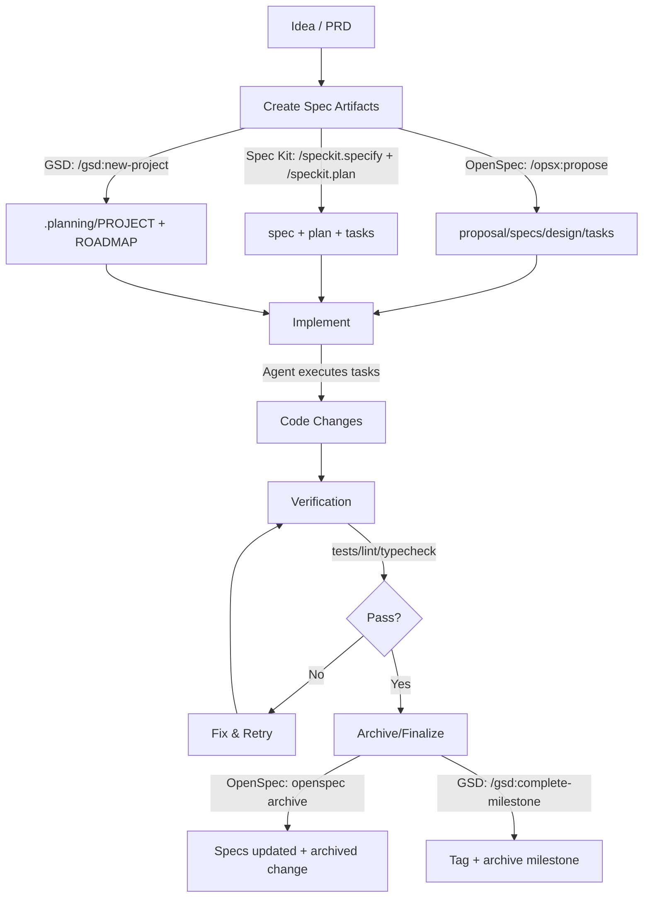

# 开发者工具与框架深度研究报告

## 执行摘要

这批名称（getshitdone、openspec、speckit、planwithfiles、superpowes、bmad-methed、workflows、everything、claude、code、ralph）里，**大多数并非传统“框架/库”，而是围绕 AI 编程代理（尤其是 Claude Code、Cursor、GitHub Copilot、Codex 等）的“工作流系统 / 规范驱动（Spec/PRD-driven）开发工具 / 插件市场与技能（skills）层”**。它们共同要解决的问题高度一致：**上下文衰减、目标漂移、产物缺失、缺少可验证闭环（tests/linters/build）导致的“能写但不稳”**。例如 GSD 明确宣称要解决“context rot”（随着上下文窗口变满，质量退化）并提供少量高层命令把复杂性放到系统内部。 cite

综合对比后，可以把它们理解为三层能力栈：

第一层是**“规范/产物层”**：把需求、变更、设计、任务列表落到仓库文件系统，以便版本化、可审计、可复用（OpenSpec、Spec Kit）。OpenSpec 通过 `openspec init` 创建 `.openspec`、`AGENTS.md`、`project.md` 以及为多种工具生成配置；并提供 `validate/archive/update` 等 CLI 保证产物结构与归档闭环。 cite Spec Kit 则以 `/speckit.constitution → /speckit.specify → /speckit.plan → /speckit.tasks → /speckit.implement` 的阶段流程推动“规格可执行”。 cite

第二层是**“工作流/技能层（在 Claude Code 等工具内以插件呈现）”**：把“怎么做”固化到可触发的 recipes/skills（planning-with-files、Superpowers、Claude Code Workflows、BMAD Method）。它们通常通过 Claude Code 插件市场命令安装（`/plugin marketplace add …`、`/plugin install …`），并通过 hooks 在关键节点强制执行“读计划/写日志/停止前验证”等行为。 cite

第三层是**“自动化编排与 CI/CD 层”**：把代理引入 GitHub Actions 或长时间循环运行，形成“持续 AI（Continuous AI）”式仓库自动化（GitHub Agentic Workflows/gh-aw、Claude Code GitHub Actions、Ralph）。GitHub Agentic Workflows 官方强调“在 GitHub Actions 中运行、强 guardrails、安全优先”，并明确提示“早期开发、可能大改、风险需谨慎”。 cite Claude Code 也提供 GitHub Actions：通过 PR/Issue 里 `@claude` 触发自动实现/修复，并基于 Agent SDK。 cite

**实践建议（先给结论）**：  
如果你希望“最少手动仪式 + 最大可交付闭环”，偏个人/小团队：优先考虑 **GSD + planning-with-files + Claude Code**；如果你希望“规格结构清晰、工具无关、可验证/可归档、适合团队协作”：优先 **OpenSpec**；如果你希望“更强的阶段流程与组织级规范（constitution）”，并能接受 Python/uv 等前置：优先 **Spec Kit**。 cite  
当你进入“仓库级自动化”（每日报告、自动 triage、自动 PR/修复）再引入 **gh-aw / Claude Code GitHub Actions**，并严格最小权限与人工复核。 cite

## 名称消歧与选型假设

本次列表存在多处歧义/拼写问题。我在无需二次追问的前提下做了可复现的“名称解析”，并在每个条目里说明候选与取舍依据（优先：官方文档/官网/高星 GitHub 仓库/明确 CLI 语义）。

getshitdone 被解析为 **gsd-build/get-shit-done（GET SHIT DONE / GSD）**：其 README 提供明确安装命令 `npx get-shit-done-cc@latest`，并解释用途为针对 Claude Code/OpenCode/Gemini CLI/Codex 的元提示与规范驱动系统。 citeturn4search3

openspec 被解析为 **Fission-AI/OpenSpec（openspec.dev / @fission-ai/openspec）**：官网给出全局安装命令，TheDocs 给出完整 CLI 参考（`openspec init/list/show/view/validate/archive/update`）。 cite

speckit 出现两次：高度一致地指向 **GitHub Spec Kit（github/spec-kit / github.github.com/spec-kit / speckit.org）**。官方文档与仓库都使用 `/speckit.*` 命名空间，且提供 `specify` CLI。 citeturn4search5

planwithfiles 被解析为 **planning-with-files（Claude Code skill/plugin）**：仓库提供 Claude Code 插件安装命令与 `/planning-with-files:*` 命令，并明确提出“3-File Pattern”。 cite

superpowes 应为拼写错误，解析为 **obra/superpowers**：仓库 README 描述其为“coding agents 的完整软件开发工作流”，并提供 Claude Code/Cursor/Gemini/Codex/OpenCode 的安装方式。 cite

bmad-methed 应为拼写错误，解析为 **BMad Method（bmad-code-org/BMAD-METHOD / docs.bmad-method.org）**：官方文档提供 `npx bmad-method install` 及完整非交互安装 flags，并说明 `bmad-help` 为引导入口。 cite

workflows 是最泛化的词。本报告列出三个高相关候选：  
其一是 **GitHub Actions workflows（gh workflow CLI）**：GitHub CLI 官方手册清晰定义了 `gh workflow list/run/view/enable/disable` 与常用 flags。 cite  
其二是 **GitHub Agentic Workflows（gh-aw 扩展）**：官方站点强调“用 Markdown 描述意图，在 Actions 中运行代理”，并提供 CLI `gh extension install github/gh-aw`、`gh aw add-wizard/compile/run`。 cite  
其三是 **Claude Code Workflows（shinpr/claude-code-workflows）**：这是 Claude Code 插件市场/recipes 集合，入口命令形如 `/recipe-implement`。 cite

everything 同样泛化，但最符合“开发者工具”的主流含义是 **Voidtools Everything 文件搜索**与其命令行：官方提供 Everything.exe 的命令行选项；另有官方开源的 ES CLI（`es.exe`）用于从命令行查询 Everything 数据库。 cite

claude 在开发者语境下对应 **Anthropic Claude API + Claude Code 产品线**：API Overview 明确 `https://api.anthropic.com` 与 `POST /v1/messages` 为核心；Claude Code 文档给出 `claude` CLI 与大量 flags，并提供 Plugins 与 GitHub Actions 集成。 cite

code 也是高度泛化：在 CLI 场景最常见指 **VS Code 的 `code` 命令**；而在本批“AI 代理工作流”语境里也可能指 **Claude Code** 或 **Codex CLI**。本报告主条目采用“VS Code `code` CLI”，并在对比与场景选择里把 Claude Code 单列（归入 claude）。VS Code 官方文档详细列出 `code .`、`--install-extension`、`code chat`、`code tunnel` 等。 cite

ralph 存在多个“同名项目”。我选取最贴合“AI 编程代理编排/PRD-driven”的两个候选并并行给出：  
其一是 **nitodeco/ralph（ralph-cli.dev）**：官网 + README 提供 `curl … | bash` 安装、`ralph init`、`ralph run [iterations]` 以及 `progress/task` 子命令组合；并支持 Cursor/Claude/Codex。 cite  
其二是 **jackemcpherson/ralph-cli**：以 Python CLI 实现“Ralph iteration pattern”，提供 `ralph prd/tasks/loop/review/sync` 等命令与 flags。 cite  
另有与 xAPI 校验相关的 “Ralph” CLI（openfun 体系）与本主题不匹配，因此仅在附注中提及为低相关候选。 citeturn1search11

## 工具画像与深度分析

下文按你要求的六个维度（用途、核心命令、工作流/集成、优劣、最佳实践/配置、适用场景与选择）逐一给出。为了可执行性，我对每个工具都至少提供“能复制运行”的命令/flags（无官方 CLI 的则给出官方 slash/plugin 命令或说明缺失）。

### GET SHIT DONE

GSD（GET SHIT DONE）是一个面向 Claude Code / OpenCode / Gemini CLI / Codex 的轻量“元工作流系统”，核心目标是通过上下文工程、子代理编排与状态管理来缓解“context rot”，并把用户侧操作压缩成少量 `/gsd:*` 命令。 cite

核心使用路径通常分两部分：先安装，再在 Claude Code 等代理里调用 slash commands。官方 README 给出的安装与非交互安装 flags（适合脚本、Docker、CI）如下。 cite
```bash
# 交互式安装
npx get-shit-done-cc@latest

# 非交互：选择 runtime + 安装位置（global/local）
npx get-shit-done-cc --claude --global
npx get-shit-done-cc --claude --local
npx get-shit-done-cc --opencode --global
npx get-shit-done-cc --gemini --global
npx get-shit-done-cc --codex --global
npx get-shit-done-cc --all --global

# 位置快捷 flag（README 说明 --global 可用 -g，--local 可用 -l）
```
安装后验证入口也因代理不同：Claude Code/Gemini 使用 `/gsd:help`，OpenCode 使用 `/gsd-help`，Codex 使用 `$gsd-help`。 cite

典型工作流是“项目 → milestone → phase”的闭环：`/gsd:new-project` 生成项目与路线图；每个 phase 依次 `/gsd:discuss-phase N → /gsd:plan-phase N → /gsd:execute-phase N → /gsd:verify-work N`；里程碑末尾 `/gsd:audit-milestone` 与 `/gsd:complete-milestone`。官方 User Guide 还给出更细的导航命令（`/gsd:progress`、`/gsd:resume-work`、`/gsd:pause-work`、`/gsd:update` 等）和 brownfield 工具（如 `/gsd:map-codebase`、`/gsd:quick`、`/gsd:debug`）。 cite

GSD 的“可验证闭环”特色之一是其 Nyquist validation：在 plan-phase 研究阶段把需求映射到自动化验证命令，要求每个任务具备反馈契约（VALIDATION.md），否则 plan-checker 不通过；并允许在设置里关闭（`workflow.nyquist_validation: false`）以加速原型。 cite

优势与弱点（分析基于其官方设计与命令集）如下：它的强项是“把多代理研究/规划/执行/验证封装成一致接口”，并提供 profile（quality/balanced/budget）与开关（research/plan_check/verifier/nyquist_validation）控制成本与严格度；弱点是系统仍然复杂、对 Git 分支与产物目录管理有依赖，且高质量模式可能成本较高。其配置文件位于 `.planning/config.json`，并给出 interactive vs yolo、granularity、model_profile 等选项；敏感项目还可设 `commit_docs: false` 并将 `.planning/` 加入 `.gitignore` 避免规划产物进仓库。 cite

推荐配置与最佳实践上，GSD 官方明确建议：在关键命令之间使用 Claude Code 的 `/clear` 清空上下文、用 `/gsd:resume-work` 或 `/gsd:progress` 恢复状态，以保持质量稳定；成本过高时用 `/gsd:set-profile budget` 并在 `/gsd:settings` 里关掉某些代理。 cite

适用场景上，GSD 最适合“你愿意遵循分 phase 的流程、希望 AI 不只是生成代码而是能持续交付”的个人/小团队；如果你更看重“工具无关、规范文件结构独立于某个工作流系统”，或者团队想把 spec 工具标准化，OpenSpec/Spec Kit 往往更合适（见后文对比）。 cite

### OpenSpec

OpenSpec 是一个“轻量 spec-driven 框架”，强调 **通用、开源、无需 API keys/MCP** 的工作流抽象；其核心由 CLI（`openspec …`）+ 代理侧 slash commands（如 `/opsx:propose`）组成。官网与仓库 README 都给出全局安装与 Quick Start：`npm install -g @fission-ai/openspec@latest` 后在项目里 `openspec init`，然后让 AI 执行 `/opsx:propose <what-you-want-to-build>`。 cite

OpenSpec 的“产物模型”非常明确：每个 change 目录包含 proposal/specs/design/tasks；示例中 `/opsx:propose` 会创建 `openspec/changes/<name>/` 并产出 `proposal.md`、`specs/`、`design.md`、`tasks.md`，随后 `/opsx:apply` 执行任务，`/opsx:archive` 归档到 `openspec/changes/archive/YYYY-MM-DD-…` 并更新 specs。 cite

CLI 的核心命令与常用 flags（可直接复制）如下。官方 TheDocs 对每条命令的语义与选项给出明确说明： cite
```bash
# 初始化/扩展：生成 .openspec、AGENTS.md、project.md，并为选定工具生成配置
openspec init [path] --tools all
openspec init . --tools claude,cursor

# 浏览
openspec list           # 默认列出 active changes
openspec list --specs   # 列 specs
openspec show <item> --json
openspec view           # 交互式 dashboard

# 校验（Zod schema 校验结构与格式）
openspec validate --all
openspec validate --changes --strict --concurrency 6
openspec validate my-change --json

# 归档：要求 tasks.md 全部完成；合并 DELTAS；移动到 archive；可用于 CI 的 -y
openspec archive my-change -y
openspec archive my-change --skip-specs
openspec archive my-change --no-validate -y

# 更新：刷新指令文件与 slash commands，且使用标记块避免覆盖用户自定义
openspec update
```

与编辑器/代理的集成方式上，OpenSpec 的一个关键优势是“多工具生成配置路径规则”。官方 supported-tools 文档列出：对 Claude Code 会安装到 `.claude/skills/openspec-*/SKILL.md` 与 `.claude/commands/opsx/<id>.md` 等路径，并说明可通过 `openspec config profile` 切换 profile（默认 core：propose/explore/apply/archive），再运行 `openspec update` 应用；并支持扩展工作流（new/continue/ff/verify/sync/bulk-archive/onboard）。 cite

OpenSpec 的优点是：产物清晰、工具无关、CLI 可验证/可归档，且 update 以 marker 方式做“安全更新”；缺点主要来自两点：其工作流要求团队坚持维护 specs/tasks 的结构（否则就退化为“又一堆 markdown”），以及其提供匿名遥测（可通过 `OPENSPEC_TELEMETRY=0` 或 `DO_NOT_TRACK=1` 关闭，且官方说明 CI 中自动禁用）。 cite

最佳实践上，OpenSpec 自己也强调“高推理模型更好”和“上下文卫生（清空上下文）”。这个建议与 GSD/Spec Kit 的“分阶段、分支化、避免上下文饱和”原则一致：在实现前清理 chat 上下文，关键决策写进 artifacts，让后续可复用、可回滚。 cite（后两者用于支撑“上盘写文件/分阶段”的共性原则）

适用场景上，如果你需要“跨工具/跨 IDE 的一致规范层”，要把组织规范沉淀为仓库结构（尤其多团队、多 AI 工具并用），OpenSpec 往往更合适；如果你需要更强的“代理自动执行闭环”并愿意跟随其 phase/milestone 模型，GSD 会更省操作。 cite

### Spec Kit

Spec Kit 是 GitHub 推出的 Spec-Driven Development（SDD）工具包，由 `specify` CLI + AI 代理内的 `/speckit.*` commands 构成，目标是把“规格变成可执行产物”。其官方 docs 清晰给出 6 步流程：定义 constitution、创建 spec、clarify、plan、tasks/analyze、implement。 cite

安装/初始化的“可复制命令”主要有两种路径：一次性 `uvx`（每次取最新）或长期安装 `uv tool install specify-cli`。官方仓库 README 与 Installation Guide 同时给出示例，并表明依赖 Python 3.11+、uv 与 Git；并可通过 `--ai` 指定代理（claude/gemini/copilot/codebuddy），通过 `--script sh|ps` 指定脚本类型，必要时 `--ignore-agent-tools` 跳过工具检查。 cite
```bash
# 推荐：持久安装
uv tool install specify-cli --from git+https://github.com/github/spec-kit.git
specify init <PROJECT_NAME>
specify init --here --ai claude

# 一次性使用：无需升级
uvx --from git+https://github.com/github/spec-kit.git specify init <PROJECT_NAME>
uvx --from git+https://github.com/github/spec-kit.git specify init --here --ai claude --script ps
uvx --from git+https://github.com/github/spec-kit.git specify init <project> --ai claude --ignore-agent-tools

# 验证/巡检
specify check
```

在 AI 代理侧（Claude Code / Copilot 等）核心 slash commands 示例： cite
```text
/speckit.constitution <你的工程原则与约束>
/speckit.specify <你要做什么与为什么>
/speckit.clarify <聚焦澄清点，例如安全/性能>
/speckit.plan <技术栈与架构决策>
/speckit.tasks
/speckit.analyze
/speckit.implement
/speckit.checklist
```

典型工作流/集成模式上，Spec Kit 有一个很“工程化”的设计：它强调 **Context Awareness**，命令会基于当前 Git 分支识别“活动 feature”（docs 里举例 `001-feature-name`），切分支即可切换规格上下文；同时官方 Upgrade Guide 说明 `specify init --here --force` 可更新 slash commands、scripts、templates 等项目文件，并提醒“memory”类共享文件可能有注意事项。 cite

优点主要是：流程定义清晰、组织级原则（constitution）作为第一等输入、并提供 analyze/checklist 进行一致性检查；弱点是：前置依赖相对多（Python/uv）、流程更“重”，对只想快速迭代的人会有负担。OpenSpec README 甚至从对比角度评价 Spec Kit “thorough but heavyweight、rigid phase gates、Python setup”，这属于 OpenSpec 视角但能提示“感受差异”。 cite

最佳实践上：Spec Kit Quick Start 明确建议复杂项目按 phase 分段实现以避免上下文饱和（先核心，再扩展）；这与 GSD 的分 phase 和 planning-with-files 的“把重要信息写盘”一致。 cite

适用场景上：当你需要“规格先行、可审计、团队可 review 的制度化流程”（尤其重视工程原则与一致性），Spec Kit 通常更合适；当你更在意“轻量 + 多工具 + 自由迭代”，OpenSpec 更顺滑；当你追求“最少命令、自动闭环交付”，GSD 更像“强执行层”。 cite

### Planning with Files

Planning with Files 是一个 Claude Code skill/plugin，把“Manus-style 持久化规划”模式落到仓库文件系统。它明确指出 AI 代理常见问题（易失记忆、目标漂移、错误不沉淀、把一切塞进上下文），并给出解决方案 **3-File Pattern**：`task_plan.md`（阶段与进度）、`findings.md`（研究发现）、`progress.md`（会话日志与测试结果）；同时用 hooks 强制“重大决策前重读计划、写完后提醒更新、停止前验证完成”。 cite

Claude Code 下的安装与入口命令如下（仓库给出了 Quick Install 与命令别名）。 cite
```text
/plugin marketplace add OthmanAdi/planning-with-files
/plugin install planning-with-files@planning-with-files

/planning-with-files:plan      # 可在自动补全里用 /plan 找到
/planning-with-files:status
/planning-with-files:start
```

它还提供“把 skill 复制到本地 skills 目录”的替代方式（用于获得不带前缀的命令名），并给出 macOS/Linux 的 `cp -r …` 与 Windows PowerShell 的 `Copy-Item` 示例。 cite

集成模式上，Planning with Files 的目录结构展示了它面向多平台代理：除了 Claude Code 插件外，也包含 `.gemini/`、`.codex/`、`.opencode/`、`.cursor/` 等技能/钩子与平台文档（gemini/cursor/windows 等）。 cite

强项是“极低仪式成本地把关键上下文写盘”，尤其适合研究型、多步骤、跨多次会话的任务；弱点是：它本身不是完整的 spec/plan/execute 系统，仍需要你（或其他工作流系统）去决定任务拆分与验收标准，且“写盘纪律”如果被忽略也会退化。其仓库也给出“Key Rules”（先建 plan、每两次浏览写 findings、记录全部错误、避免重复失败）和“何时用/何时不用”的适用范围。 cite

最推荐的组合方式是把它作为“底层记忆层”：与 GSD、OpenSpec、Spec Kit、Superpowers 这类更高层流程结合，使任何一个系统在上下文重置后仍能从 `task_plan/findings/progress` 恢复状态。 cite

### Superpowers

Superpowers 是一个面向 coding agents 的“完整软件开发工作流”，由 composable skills + 初始指令组成，强调先抽取规格、分块展示设计以便人工确认、再生成详细实现计划，并强调 TDD（RED/GREEN/REFACTOR）、YAGNI、DRY 与子代理驱动开发。 cite

安装方式覆盖 Claude Code/Cursor/Gemini CLI/Codex/OpenCode：在 Claude Code 既可从官方市场安装，也可先加 marketplace 再安装；Gemini CLI 则用 `gemini extensions install …`。 cite
```text
# Claude Code 官方市场
/plugin install superpowers@claude-plugins-official

# Claude Code：自建 marketplace
/plugin marketplace add obra/superpowers-marketplace
/plugin install superpowers@superpowers-marketplace

# Cursor
/add-plugin superpowers

# Gemini CLI
gemini extensions install https://github.com/obra/superpowers
gemini extensions update superpowers
```

Superpowers 在 README 里直接列出“基础工作流链条”：brainstorming → 使用 git worktrees（隔离分支工作区、跑基线测试）→ 写计划（2–5 分钟粒度、有文件路径与验证步骤）→ 子代理驱动执行（两阶段 review：规格符合性→代码质量）→ TDD 强制循环 → 任务间 code review → 收尾分支（测试、merge/PR 选择、清理 worktree）。 cite

强项是“强制工程纪律（TDD、系统化调试、分支隔离）”并把它变成代理自动触发的技能，而不是提示语；弱点是：这种强约束对探索性原型可能“过重”，且依赖于你对 git/worktree 与测试基线的接受度。 cite

最佳实践上，Superpowers 倾向于把“安全/质量门禁”前置：先设计签字，再开 worktree，然后以可验证步骤推进。它适合想把 AI 代理变成“像资深工程师一样按流程交付”的团队。 cite

### BMad Method

BMad Method 是一个 AI 驱动的敏捷开发框架/模块生态，官方强调它通过“专门化代理 + 引导式工作流 + 随项目复杂度自适应的计划深度”覆盖从 ideation 到部署的全生命周期，并提供 `bmad-help` 作为启动后的引导入口。 cite

安装入口明确为 `npx bmad-method install`，并支持 `@next` 版本与从 GitHub main 分支安装；非交互安装文档则给出面向 CI/CD 的 flags 表（`--directory/--modules/--tools/--action/...`）。 cite
```bash
# 交互安装
npx bmad-method install

# 预发布
npx bmad-method@next install

# main 分支（可能不稳定）
npx github:bmad-code-org/BMAD-METHOD install

# 非交互（CI/CD/脚本）
npx bmad-method install \
  --directory /path/to/project \
  --modules bmm \
  --tools claude-code \
  --yes
```

BMad 把“技能/代理”落盘到项目结构：安装后会出现 `_bmad/`（模块与配置）与 `_bmad-output/`（生成产物），并按你选择的工具生成对应目录（例如 `.claude/skills/…`、`.cursor/skills/…`）。 cite  
验证方式是运行 `bmad-help`，它会确认安装、展示可用模块并推荐下一步，也支持“像命令一样提问”（`bmad-help I just installed...`）。 cite

优势在于“跨角色代理（PM/架构/开发/UX 等）+ 敏捷流程外壳”，更适合希望把 AI 工作流组织化、模块化扩展的团队；弱点是：相较 GSD/OpenSpec/Planning-with-files，它更像“方法论与生态”，新用户理解成本更高，且产物与模块选择空间更大，容易在早期走偏。 cite

最佳实践是把 `bmad-help` 当作唯一入口，先做最小模块集（多数用户只需 BMad Method 模块），并在 CI/CD 安装时固定 `--modules/--tools` 以保证团队一致性。 cite

### Claude Code Workflows

Claude Code Workflows（shinpr/claude-code-workflows）是一组“端到端开发 workflows/recipes 插件”，通过专门化 agents 处理需求、设计、实现与质量检查，目标是输出可 review 的代码而非一次性生成。其 Quick Start 明确给出：启动 `claude`，添加 marketplace，安装插件，**重启会话（required）** 后用 `/recipe-implement` 等入口开始。 cite

核心安装与入口如下： cite
```text
claude
/plugin marketplace add shinpr/claude-code-workflows
/plugin install dev-workflows@claude-code-workflows
# restart Claude Code session
/recipe-implement <your feature>
```

它把入口命令体系化为 `recipe-` 前缀，并按后端/通用、前端（React/TS）、全栈给出 recipes 列表：例如 `/recipe-design`、`/recipe-plan`、`/recipe-build`、`/recipe-review`、`/recipe-diagnose`、`/recipe-reverse-engineer`，前端侧有 `/recipe-front-design`、`/recipe-front-plan`、`/recipe-front-build` 等；全栈需要同时安装两插件并用 `/recipe-fullstack-implement`。 cite

插件还提供“skills-only”模式（`dev-skills`），用于“你已有编排系统（自定义 prompts/脚本/CI 驱动 loop）但想要最佳实践规则层”；并警告不要与完整 workflows 插件并装，否则重复 skills 会被忽略。 cite

优势是把“从需求到设计到执行到修复”的流水线固化成 recipes，减少你设计流程的负担；弱点是更强的“体系化”意味着你要接受它的 artifacts（PRD/Design Doc/UI Spec）与代理分工，且插件在 Claude Code 的权限与插件安全模型下运行（后文会强调）。 cite

最佳实践是：用“skills-only”作为渐进引入；当团队接受后再上 workflows；并把插件安装到 **project scope** 以便团队一致（Claude Code 官方支持 user/project/local scope 的安装范围）。 cite

### GitHub Agentic Workflows 与 gh workflow

如果你说的 workflows 指“仓库自动化”，这里有两条主线。

其一，GitHub Agentic Workflows（gh-aw）把 AI 代理引入 GitHub Actions：官方定位是“用 Markdown 定义自动化，运行在 Actions，具备强 guardrails，默认只读权限，写操作通过 safe outputs 显式批准”。同时官方明确提示其仍在早期开发，使用需谨慎并建议人类监督。 cite

其 Quick Start 给出可复制的 CLI：安装扩展、添加样例 workflow、配置密钥（COPILOT_GITHUB_TOKEN/ANTHROPIC_API_KEY/OPENAI_API_KEY）、生成 `.github/workflows/` 中的 workflow 文件，必要时 `gh aw compile` 重新生成 YAML，再 `gh aw run …` 触发运行。 cite
```bash
gh extension install github/gh-aw

# 交互式向导：添加一个预置 workflow（示例 daily repo report）
gh aw add-wizard githubnext/agentics/daily-repo-status

# 修改 frontmatter 后重新编译
gh aw compile

# 手动触发
gh aw run daily-repo-status
```

其二，如果你说的 workflows 是“管理 GitHub Actions 的 workflow 文件”，GitHub CLI 提供 `gh workflow` 子命令族：`list/run/view/enable/disable`。官方手册给出 `--repo`、`--all`、`--limit`、`--json`、`--ref`、`-f/-F` 等常用选项与示例（包括通过 stdin 传 JSON inputs）。 cite
```bash
# 列出 workflows（默认隐藏 disabled）
gh workflow list -L 100
gh workflow list --all --json id,name,path,state

# 查看 workflow yaml 或跳浏览器
gh workflow view triage.yml --yaml
gh workflow view 0451 --web

# 触发 workflow_dispatch（必须 workflow 支持 on.workflow_dispatch）
gh workflow run triage.yml --ref my-branch
gh workflow run triage.yml -f name=scully -f greeting=hello
echo '{"name":"scully","greeting":"hello"}' | gh workflow run triage.yml --json
```

选择建议：如果你要“代理驱动的仓库自动改动/日常维护”，看 gh-aw；如果你要“手动/脚本化触发与检查现有 Actions”，用 gh workflow。两者可以叠加：gh-aw 负责生成/编译/运行 agentic workflows，gh workflow 负责对传统 workflow 的操作与触发。 cite

### Claude 与 Claude Code

在你的列表里 claude 是一个“平台级工具”，而 Claude Code 则是“终端内 agentic coding 工具”。  
Claude API 官方概览明确：Claude API 是 RESTful，基地址 `https://api.anthropic.com`，核心是 Messages API（`POST /v1/messages`）；并列出了 Message Batches（异步批处理、宣称 50% 成本下降）、Token Counting、Models 等 API。 cite

Claude Code 是 Anthropic 的终端代理工具：其 GitHub 仓库说明它运行在终端、理解代码库、可处理 git 工作流，并可在 GitHub 上通过 `@claude` 使用。 citeturn25search3  
Claude Code 官方 CLI reference 既给出基本命令（`claude`、`claude -p`、`claude -c`、`claude -r`、`claude update`、`claude auth login/status`、`claude agents/mcp/remote-control`），也给出大量 flags。 cite

其中与“安全/自动化”最相关的 flags（建议你重点理解）包括：

`--tools` / `--allowedTools` / `--disallowedTools`：限制或白名单化可用工具；对降低“代理乱跑命令”风险非常关键。 cite  
`--permission-mode` 与 `--dangerously-skip-permissions`：启动权限模式或跳过权限提示；官方把它标注为“use with caution”。 cite  
`--max-turns`、`--max-budget-usd`：对非交互（print mode）设置回合数/预算上限，避免 runaway cost。 cite  
`--worktree`：在 `<repo>/.claude/worktrees/<name>` 下开启隔离 git worktree；这与 Superpowers 的“用 worktree 隔离开发分支”理念一致。 cite

Claude Code 的插件与市场体系也非常成熟：官方“Discover plugins”文档说明 `/plugin marketplace add` 支持 GitHub repo、任意 Git URL、local path、remote URL；`/plugin install plugin@marketplace` 安装插件，并强调安装范围（user/project/local/managed）与安全注意（插件可执行任意代码，应只信任来源）。 cite  
同时，官方 Plugins reference 还提供了非交互的 `claude plugin install/uninstall/enable/disable/update` 命令（适合脚本化），并给出 `--scope` 选项。 cite
```bash
# 非交互管理插件（更适合脚本/CI 的准备阶段）
claude plugin install formatter@my-marketplace --scope project
claude plugin update formatter@my-marketplace --scope project
claude plugin disable formatter@my-marketplace --scope project
```

CI/CD 集成方面，Claude Code GitHub Actions 官方文档说明：在 PR/Issue 中 `@claude` 可触发分析/实现/修复，并指出它建立在 Claude Agent SDK 之上；并提供通过终端在 Claude Code 里运行 `/install-github-app` 的快速安装方式。 cite

适用场景上：如果你的目标是“把 AI 变成工程系统的一部分”，Claude Code 通常是这些工作流工具的运行时基础（GSD/OpenSpec/Planning-with-files/Superpowers/Claude Code Workflows/BMad 都在不同方式上与其集成）。 cite

### VS Code 的 code CLI

如果 code 指 VS Code 的命令行入口，VS Code 官方文档给出非常具体的命令与选项：`code --help`、`code .`、`-n/-r`（新窗口/复用）、`-g file:line:col`、`--install-extension`、`--profile`、`code chat …`（从命令行启动聊天）、`code tunnel`（远程隧道）等。 cite

你最常用的开发者路径通常是：

启动/定位文件：
```bash
code .
code -g src/main.ts:120:5
code -d fileA.ts fileB.ts
```
扩展与配置（可用于团队“环境一致性脚本”）：
```bash
code --list-extensions --show-versions
code --install-extension ms-python.python --force
code --install-extension publisher.extension@1.2.3 --force
```
把“AI/Chat”拉进 shell 工作流（VS Code 文档给出 `code chat` 子命令与 `--mode`、`--add-file`、stdin 管道等）： cite
```bash
code chat Find and fix all untyped variables
python app.py | code chat why does it fail -
```

与本批 AI 代理工作流的关系：VS Code 既可以作为编辑器承载 Copilot/Claude/Codex 等，也能通过 CLI 做“启动+注入上下文”式的自动化；但 VS Code 本身不替代 OpenSpec/Spec Kit 这类“规范产物层”。它更像“交互与集成底座”。 cite

### Everything 与 ES CLI

Everything（Voidtools）是 Windows 上极常用的“近实时文件索引搜索”工具；其官方文档列出 Everything.exe 的大量命令行开关，涵盖数据库/文件列表、连接、以及搜索参数（`-regex/-noregex`、`-case/-nocase`、`-matchpath`、`-search`、`-sort` 等）。 cite  
例如它支持 `-create-file-list <filename> <path>` 生成 file list，或用 `-search <text>`、`-regex` 等控制搜索。 cite

更“开发者友好”的命令行方式是 voidtools 官方开源的 ES（`es.exe`）CLI：README 给出使用格式 `es.exe [options] search text`，并列出搜索选项（`-r/-regex`、`-i/-case`、`-w/-whole-word`、`-p/-match-path`、`-n/-max-results` 等），以及“Everything IPC window 必须存在（Everything 客户端需运行）”等注意点（通过错误码体现）。 cite
```bash
es everything ext:exe;ini
es -r -n 50 "TODO|FIXME"
es -p "src/" -w "Repository"
```

集成模式上：Everything/ES 并不参与“AI 代理工作流”，但在大型代码库、单机多仓库场景里，它是**极低成本的本地索引层**，常用于配合脚本、编辑器或 AI 的文件定位（特别是 Windows 环境）。 cite

### Ralph

如前所述，这里至少有两个高相关 “Ralph”。

nitodeco/ralph（ralph-cli.dev）定位为“长时间 PRD-driven 开发的 CLI harness”，声称可以在你离开时持续推进 tasks，并在完成后创建 PR。其官网展示 `ralph start` 示例，并给出一行安装。 cite  
其 GitHub README 给出的可复制命令与工作流是：`curl … | bash` 安装，`ralph init` 初始化（在 `~/.ralph` 创建必要文件并选择 Cursor/Claude/Codex 代理），然后 `ralph run [iterations]` 循环执行；循环内部会用 `ralph progress` 与 `ralph task list/current/done` 更新状态并提交变更。 cite

jackemcpherson/ralph-cli 则更像“面向 Claude Code 的 Python CLI 实现”，提供更传统的命令集合：安装（Homebrew/PyPI）、`ralph init/prd/tasks/once/loop/review/sync`，并且对 `init/prd/once/loop/review/sync` 给出了 `--force/--verbose/--max-fix-attempts/--scope` 等 flags；同时把质量检查配置固化在 `CLAUDE.md`（YAML checks）里。 cite

两者共同优势是“把长时间循环、失败重试、任务拆分/推进写成工具”，共同弱点是：长时间代理运行必然放大安全风险与成本不确定性，因此必须配合严格的权限限制、预算上限、以及 CI/PR 审核门禁。这个结论可由 Claude Code 自身提供的 `--max-budget-usd/--max-turns/--tools` 等控制手段与 gh-aw 的“安全优先/默认只读”理念共同支撑。 cite

## 核心命令速查表

下表把“最常用入口命令”压缩成可复制清单（CLI/Slash/Plugin 两种形态混排）。注意：带 `@marketplace` 的为 Claude Code 插件市场语法；`--scope project` 这类为 Claude Code 非交互插件管理语法。 cite

| 名称（解析后） | 核心入口命令 | 常用 flags/变体（示例） |
|---|---|---|
| GSD / getshitdone | `npx get-shit-done-cc@latest`；`/gsd:new-project` | 安装：`--claude/--opencode/--gemini/--codex/--all` + `--global/--local`；流程：`/gsd:plan-phase N`、`/gsd:execute-phase N`、`/gsd:set-profile budget` |
| OpenSpec / openspec | `npm i -g @fission-ai/openspec@latest`；`openspec init`；`/opsx:propose` | `openspec init --tools claude,cursor`；`openspec validate --all --strict --json`；`openspec archive -y`；`openspec update` |
| Spec Kit / speckit | `specify init …` 或 `uvx … specify init …`；`/speckit.specify` | `--ai claude`、`--script sh|ps`、`--ignore-agent-tools`；升级：`specify init --here --force`；验证：`specify check` |
| Planning with Files / planwithfiles | `/plugin marketplace add OthmanAdi/planning-with-files`；`/planning-with-files:plan` | 入口：`/plan`（autocomplete）；本地复制 skills：`cp -r …` / `Copy-Item …` |
| Superpowers / superpowes | `/plugin install superpowers@claude-plugins-official`；`gemini extensions install …` | Claude Code marketplace：`/plugin marketplace add …`；更新：`/plugin update superpowers`；Gemini：`gemini extensions update superpowers` |
| BMad Method / bmad-methed | `npx bmad-method install`；`bmad-help` | 非交互：`--directory/--modules/--tools/--action`；版本：`npx bmad-method@next install` |
| Claude Code Workflows / workflows 候选 | `/plugin marketplace add shinpr/claude-code-workflows`；`/recipe-implement` | 插件切换：`/plugin uninstall …`；recipes：`/recipe-front-design`、`/recipe-review`、`/recipe-diagnose` |
| GitHub Agentic Workflows / workflows 候选 | `gh extension install github/gh-aw` | `gh aw add-wizard …`；`gh aw compile`；`gh aw run …` |
| GitHub Actions workflows（gh workflow）/ workflows 候选 | `gh workflow list/run/view` | `gh workflow run … --ref … -f k=v --json`；`gh workflow view --yaml` |
| Claude API / claude | `POST /v1/messages`（API） | 批处理：`/v1/messages/batches`；令牌计数：`/v1/messages/count_tokens`；模型列表：`GET /v1/models` |
| Claude Code / claude | `claude`；`claude -p "…"` | 权限/安全：`--tools`、`--allowedTools`、`--permission-mode`、`--dangerously-skip-permissions`；成本：`--max-budget-usd`、`--max-turns`；隔离：`--worktree` |
| VS Code CLI / code | `code .`；`code --help` | 扩展：`--install-extension … --force`；聊天：`code chat …`；远程：`code tunnel` |
| Everything + ES / everything | Everything.exe 参数；`es.exe [options] query` | ES：`-r/-regex`、`-n/-max-results`、`-p/-match-path`；Everything：`-search`、`-regex`、`-sort` |
| Ralph（nitodeco）/ ralph | `curl … | bash`；`ralph init`；`ralph run [iterations]` | 子命令组合：`ralph progress`、`ralph task current/done` |
| Ralph（jackemcpherson）候选 | `pip install ralph-cli`；`ralph loop` | `ralph loop --max-fix-attempts N --verbose`；`ralph review --strict`；`ralph sync --remove` |
| Claude Code 插件非交互管理 | `claude plugin install/uninstall/update` | `--scope user|project|local|managed`（update 支持 managed） |

## 典型工作流示意图

### 规范驱动到实现的闭环

该图抽象了 OpenSpec/Spec Kit/GSD 的共通骨架：把“需求/规格/计划/任务/验证”落到仓库文件，并通过 validate/verify 阶段形成可回归的反馈回路。 cite



### 仓库级自动化

该图展示 gh-aw 与 Claude Code GitHub Actions 的共同形态：由 GitHub 事件触发，在 Actions runner 内执行代理任务，形成 issue/PR 或评论输出，并要求更强的权限与人工复核。 cite

```mermaid
flowchart LR
  A[GitHub Event\n(issue/PR/schedule)] --> B[GitHub Actions Runner]
  B --> C{Automation Type}
  C -->|gh-aw markdown workflow| D[gh-aw engine\nwith guardrails]
  C -->|Claude Code GitHub Action| E[Claude Code Action\n(@claude trigger)]

  D --> F[AI Engine\n(Copilot/Claude/Codex)]
  E --> F

  F --> G[Proposed Changes\n(commits/PR/comments)]
  G --> H[Human Review Gate]
  H -->|approve| I[Merge/Ship]
  H -->|reject| J[Adjust workflow/spec/permissions]
  J --> C
```

## 对比表与场景化选择指南

### 关键特性对比表

“成熟度”这里用可观察指标近似：是否有明确官方 docs、是否有稳定 CLI/命令体系、是否提示“early development”、以及 GitHub stars/发布信息（若源页面包含）。星数随时间变化，本表反映抓取时的公开信息。 citeturn25search3

| 工具（解析后） | 核心特性（摘要） | License | 成熟度/变更风险 | 生态与集成 | 语言支持（开发语言/模型） | 典型受众 |
|---|---|---|---|---|---|---|
| GSD | phase/milestone 闭环、/gsd 命令、Nyquist 验证映射、multi-runtime 安装 | MIT cite | 命令体系稳定且发展快（README 强调快速演进） cite | Claude Code/OpenCode/Gemini/Codex；与 git、测试命令强耦合 cite | 语言无关，但依赖代理能力；可配置模型 profile cite | 个人/小团队、想“少操作+高交付” |
| OpenSpec | change/specs/design/tasks 产物模型；CLI validate/archive/update；多工具配置生成 | MIT cite | 相对稳：CLI 参考完整；可扩展 profile/workflow cite | 支持 20+ 工具；提供路径规则与 profile 切换 cite | 语言无关；强调与多代理协作 cite | 团队/多工具并行、需要规范与可归档 |
| Spec Kit | constitution/specify/plan/tasks/implement；specify CLI；分支感知 | MIT cite | 高成熟度（官方 docs + 大量 releases 信息） cite | Claude/Copilot/Gemini/Codebuddy；生成脚本与命令文件 cite | 语言无关；工具链依赖 Python/uv cite | 组织化流程、重视工程原则与一致性 |
| Planning with Files | 3-File Pattern + hooks 把“记忆写盘”；多工具目录 | MIT cite | 中等：以 plugin/skill 形态迭代；规则清晰 cite | Claude Code 插件；也提供 Gemini/Codex/OpenCode/Cursor 支持路径 cite | 语言无关；适合研究/多步任务 cite | 任何需要长上下文任务的人（配合其他系统更强） |
| Superpowers | skills 驱动完整开发流程；强 TDD；git worktrees；多平台代理安装 | MIT cite | 中高：安装/工作流说明完整；体系强约束 cite | Claude Code/Cursor/Gemini/Codex/OpenCode cite | 语言无关，但偏“工程纪律”项目 cite | 想把 AI 变成“按流程干活”的工程团队 |
| BMad Method | 模块生态 + 专家代理；非交互安装 flags 完整；bmad-help 引导 | MIT（仓库与徽标） cite | 中高：官方 docs 清晰；生态扩展快 cite | Claude Code/Cursor/其他；生成 _bmad 与 skills 目录 cite | 语言无关；强调敏捷与多角色协作 cite | 需要“方法论+模块化代理团队”的组织 |
| Claude Code Workflows | recipes（/recipe-*）端到端；skills-only 渐进引入；专门化 agents | MIT cite | 中：插件迭代快；需要重启 session cite | Claude Code 插件市场；适配后端/前端/全栈 cite | 语言无关；前端偏 React/TS cite | 想“有现成 recipes”的 Claude Code 用户 |
| GitHub Agentic Workflows | Markdown 工作流 + Actions；guardrails；默认只读；多 AI engine | 未在本页显示 license（项目层面需另查） cite | 明确 early development 警告 cite | GitHub Actions + gh 扩展；需要 API key/Token cite | 与模型无关（Copilot/Claude/Codex） cite | 维护者/平台团队、要仓库自动化 |
| gh workflow | Actions workflow 的列表/运行/查看 | GitHub CLI（产品） cite | 高：官方手册详尽 cite | GitHub Actions；适合脚本化触发/排查 cite | 与语言无关 | DevOps/维护者 |
| Claude API | REST API（Messages 等）+ Agent SDK（Claude Code as library） | 商业服务 | 高：官方文档与平台化能力 cite | 可接 Bedrock/Vertex 等；支持 Agent SDK cite | 支持多模型；应用语言取决于 SDK（TS/Python 等） cite | 构建 Claude 应用/自动化的开发者 |
| Claude Code | 终端代理 + plugins/marketplace + GitHub Actions | 官方产品 | 高：CLI/插件/CI 文档齐全 cite | IDE/终端/GitHub（@claude） citeturn25search3 | 语言无关；可限制 tools/权限/预算 cite | 想把 AI 代理引入日常工程的人 |
| VS Code code CLI | 启动编辑器、安装扩展、chat、tunnel | MS 产品 | 高：官方文档详尽 cite | 编辑器生态巨大；可承载 Copilot/Claude 等 | 语言与扩展生态相关 | 所有开发者 |
| Everything + ES | 本地文件索引搜索 + CLI 查询 | ES: MIT cite | 高（工具本体）+ 中（ES CLI） cite | Windows 本地工具；脚本/终端可调用 cite | 与语言无关 | Windows 开发者/重度本地搜索需求 |
| Ralph（nitodeco） | 长时间 PRD-driven loop；Cursor/Claude/Codex | MIT cite | 低到中（新项目迹象：stars 少，但 docs 完整） cite | 本地代理循环 + PR 交付理念 cite | 与语言无关；受代理能力影响 | 想“让代理跑久一点”的个人/小团队 |
| Ralph（jackemcpherson）候选 | Claude Code 的 Python CLI 版本；PRD→tasks→loop→review | MIT cite | 低（stars 少），但命令/flags 完整 cite | 强调质量检查写入 CLAUDE.md cite | 与语言无关；适合 Python 工具链用户 | 想要可脚本化 loop 的工程师 |

### 场景化选择

你可以按“目标对象”先分三类再选工具。

如果你的目标是“把需求与变更变成可版本化的规范产物，并保证结构/归档”，优先 OpenSpec 或 Spec Kit。OpenSpec 的 `validate/archive/update` CLI 与 “change folder + deltas merge” 模式更轻，适合多工具并用；Spec Kit 更强调 constitution 与阶段化流程，并用 `specify` CLI 冷启动/升级项目模板。 cite

如果你的目标是“让 Claude Code 内的日常开发流程更可控、更少漏项”，优先 GSD 或 Claude Code Workflows 或 Superpowers。GSD 以 `/gsd:*` 把 phase/milestone 封装；Claude Code Workflows 通过 `/recipe-*` 提供端到端 recipes；Superpowers 更强调 TDD 与 git worktrees 的工程纪律。 cite

如果你的目标是“仓库自动化/CI 中运行代理（持续 AI）”，优先 gh-aw 或 Claude Code GitHub Actions，并严格控制权限与人工复核。gh-aw 自带 guardrails 与只读默认；Claude Code Actions 通过 `@claude` 与 `/install-github-app` 简化集成，并建立在 Agent SDK 上。 cite

## 可执行的推荐方案

下面给出几套“可以直接落地”的组合方案。每套都包含推荐配置（重点在安全/一致性/可验证性），并说明为什么这么选。

### 个人独立开发或两三人小团队

首选组合：Claude Code + GSD + Planning with Files。原因是：Claude Code 负责执行与插件生态；GSD 提供“少命令但闭环”的全流程；Planning with Files 提供“跨上下文/跨会话的持久记忆层”，抵抗目标漂移。 cite

推荐配置要点：在 Claude Code 启动时不要默认开启 `--dangerously-skip-permissions`；先用 `--permission-mode plan` 或限制 `--tools`，逐步放开；成本控制可在非交互任务用 `--max-budget-usd`/`--max-turns`。GSD 侧使用 `balanced` 起步，成本压力大再 `/gsd:set-profile budget`；敏感仓库将 `.planning/` gitignore 并 `commit_docs: false`。 cite

### 需要团队共识与可审计规范的中型团队

首选组合：OpenSpec（规范层）+ Claude Code（运行时）+ gh workflow（传统 Actions 操作）。OpenSpec 提供对多工具的可复制配置路径与可验证/可归档 CLI；Claude Code 及其插件体系把规范落入日常；gh workflow 作为 DevOps 操作入口。 cite

推荐配置要点：在仓库里固定 OpenSpec profile（core or expanded），通过 `openspec update` 同步到团队；在 Claude Code 插件安装时采用 project scope（写 `.claude/settings.json`）以便所有协作者一致；并把 `openspec validate --strict` 作为 PR 前检查的一部分（可在 CI 脚本中调用）。 cite

### 强工程纪律、强调测试先行的团队

首选组合：Superpowers + Claude Code（可能辅以 OpenSpec/Spec Kit 作为规格产物层）。Superpowers 自带对 TDD、系统化调试、worktree 隔离、计划粒度的强约束，更适合把 AI 纳入“像人一样守纪律”的流水线。 cite

落地要点：把 `claude --worktree` 作为默认工作方式之一，结合 Superpowers 的“using-git-worktrees”习惯；并在仓库里明确测试基线命令，让代理每个任务都能跑出 pass/fail。 cite

### 仓库维护自动化、每天生成报告/自动 triage/自动修复

首选组合：GitHub Agentic Workflows（gh-aw）+ gh workflow +（可选）Claude Code GitHub Actions。gh-aw 更适合“预置的 repo ops 模式”，并自带安全架构与 guardrails；gh workflow 用于补充对传统 workflow 的触发与排查；Claude Code Actions 则适合在 PR/Issue 中通过 `@claude` 进行点状触发。 cite

安全要点是必须的：gh-aw 官方直接声明“早期开发、需谨慎、需监督”；因此建议把它的写操作限制在 safe outputs + 最小权限 token，并把产出落到 PR/issue 供人工 review，不让代理直接在主分支写入。 cite
